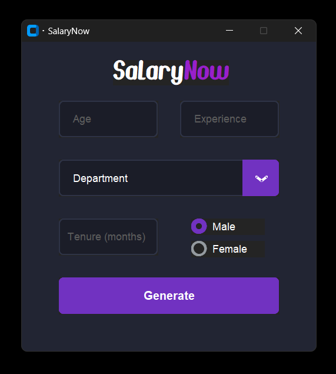

# SalaryNow
SalaryNow is a user-friendly salary prediction calculator that uses machine learning to estimate salaries based on various professional and personal factors.

Date created: 27-03-2024

  

## Features

### Salary Prediction Operations
- Create new salary predictions by inputting personal and professional details
- Read and view instant salary estimates in GBP
- Update predictions by modifying input parameters
- Delete functionality for managing predictions
- Duplicate entry prevention using unique ID generation
- Comprehensive input validation for age, experience, tenure, department and gender

### Data Management
- SQLite database integration for storing predictions
- Unique hash ID generation for each prediction
- Ability to retrieve historical predictions

## Technologies Used

### Backend
- Python: Core programming language
- scikit-learn: Machine learning library for Linear Regression model
- SQLite3: Database for storing prediction data
- joblib: For model serialization

### Frontend
- customtkinter: Modern UI toolkit for Python
- tkinter: Standard GUI library for Python

### Machine Learning
- Linear Regression model trained on Kaggle salary dataset
- Initial model accuracy: 43.75%
- Implemented stratified sampling to balance the male-to-female ratio in the dataset, improving model accuracy by 3% (43.75% to 46.99%)
- Features used: age, gender, department, years of experience, tenure
